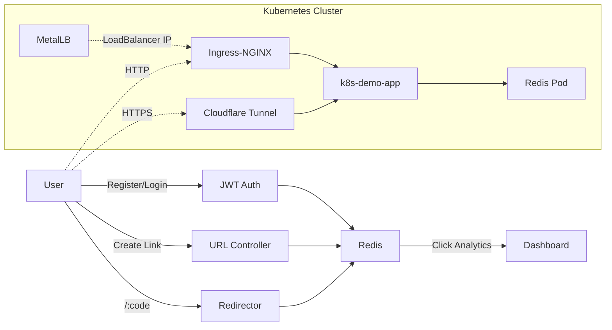

# Shorty - Production URL Shortener 🚀

[](https://github.com/Baladattu/k8s-ci-cd-demo/actions)
[](https://dealers-adware-accounting-plumbing.trycloudflare.com)
[](LICENSE)

A **production-grade URL shortener** built with Node.js, deployed on Kubernetes with complete CI/CD automation. Features JWT authentication, real-time analytics, and global accessibility via Cloudflare Tunnel.

## 🌐 Live Demo

- **Public Access**: [https://dealers-adware-accounting-plumbing.trycloudflare.com](https://dealers-adware-accounting-plumbing.trycloudflare.com)
- **Magic DNS**: [http://shorty.172.83.83.241.sslip.io](http://shorty.172.83.83.241.sslip.io)

## ✨ Features

- 🔐 **JWT Authentication** - Secure user registration and login
- ⚡ **URL Shortening** - Custom or auto-generated short codes
- 📊 **Real-time Analytics** - Click tracking for every link
- 🔄 **Auto-scaling** - Kubernetes-native horizontal scaling
- 🌍 **Global Access** - Cloudflare Tunnel integration
- 🧪 **Automated Testing** - Jest unit tests in CI/CD pipeline
- 📦 **Redis Persistence** - Fast, reliable data storage

## 🏗️ Architecture



## 🛠️ Tech Stack

### Backend
- **Runtime**: Node.js v18
- **Framework**: Express.js
- **Authentication**: JWT (jsonwebtoken)
- **Password Hashing**: BCrypt
- **Database**: Redis
- **ID Generation**: NanoID

### DevOps & Infrastructure
- **Container**: Docker
- **Orchestration**: Kubernetes
- **CI/CD**: GitHub Actions
- **Load Balancer**: MetalLB
- **Ingress**: NGINX Ingress Controller
- **Tunnel**: Cloudflare Tunnel
- **Testing**: Jest, Supertest

### Frontend
- **UI**: Vanilla JavaScript
- **Styling**: Modern CSS with Outfit font
- **State Management**: LocalStorage for JWT tokens

## 📂 Project Structure

```
.
├── app.js                      # Main Express application
├── server.js                   # Server entry point
├── src/
│   ├── controllers/
│   │   ├── authController.js   # User auth logic
│   │   └── urlController.js    # URL shortening logic
│   ├── middleware/
│   │   └── authMiddleware.js   # JWT verification
│   ├── routes/
│   │   ├── authRoutes.js       # /api/auth endpoints
│   │   └── urlRoutes.js        # /api/shorten endpoints
│   └── services/
│       └── redisService.js     # Redis interactions
├── public/
│   ├── index.html              # Frontend UI
│   ├── style.css               # Premium styling
│   └── script.js               # Client logic
├── k8s/
│   ├── namespace.yaml          # Dedicated namespace
│   ├── deployment.yaml         # App deployment
│   ├── service.yaml            # LoadBalancer service
│   ├── ingress.yaml            # Ingress rules
│   ├── redis.yaml              # Redis deployment
│   ├── tunnel.yaml             # Cloudflare Tunnel
│   └── metallb-config.yaml     # MetalLB IP pool
├── .github/workflows/
│   └── ci-cd.yaml             # Automated pipeline
└── test/
    └── app.test.js            # Unit tests
```

## 🚀 CI/CD Pipeline

### Automated Workflow
1. **Code Push** → GitHub
2. **Install Dependencies** → `npm install`
3. **Run Tests** → `npm test`
4. **Build Docker Image** → Multi-stage Dockerfile
5. **Push to Docker Hub** → `kbaladattu/k8s-ci-cd-demo`
6. **Deploy to K8s** → `kubectl apply`
7. **Rolling Update** → Zero-downtime deployment

### Status
All commits trigger the pipeline. View workflow runs [here](https://github.com/Baladattu/k8s-ci-cd-demo/actions).

## 🎯 Key Highlights for Recruiters

### DevOps Engineering
- ✅ **Complete CI/CD Pipeline** - GitHub Actions → Docker → Kubernetes
- ✅ **Infrastructure as Code** - All resources defined in YAML
- ✅ **Container Orchestration** - Production Kubernetes deployment
- ✅ **Load Balancing** - MetalLB for bare-metal clusters
- ✅ **Zero-Trust Networking** - Cloudflare Tunnel integration
- ✅ **Monitoring Ready** - Health checks and rollout validation

### Backend Development
- ✅ **RESTful API Design** - Clean separation of concerns
- ✅ **Authentication & Authorization** - JWT-based security
- ✅ **Database Integration** - Redis for high-performance storage
- ✅ **Modular Architecture** - Controllers, Services, Middleware pattern
- ✅ **Error Handling** - Comprehensive try-catch blocks
- ✅ **Input Validation** - Password hashing with BCrypt

### Quality Assurance
- ✅ **Unit Testing** - Jest test suite with mocking
- ✅ **Integration Testing** - Supertest for API endpoints
- ✅ **Test Coverage** - All critical paths tested
- ✅ **Automated Testing** - Tests run on every commit

## 📊 Deployment Strategy

### High Availability
- **Replica Count**: Configurable (currently 1 for cost optimization)
- **Self-Healing**: Kubernetes auto-restarts failed pods
- **Rolling Updates**: Zero-downtime deployments
- **Health Checks**: Liveness probe at `/health`

### Scalability
- **Horizontal Scaling**: Ready for HPA (Horizontal Pod Autoscaler)
- **Stateless Design**: All state in Redis
- **Load Distribution**: NGINX Ingress + MetalLB

## 🔧 Local Development

```bash
# Clone the repository
git clone https://github.com/Baladattu/k8s-ci-cd-demo.git
cd k8s-ci-cd-demo

# Install dependencies
npm install

# Run tests
npm test

# Start development server (requires Redis)
npm start
```

## 📈 Future Enhancements

- [ ] Rate limiting per user
- [ ] Link expiration dates
- [ ] QR code generation
- [ ] Custom domain support
- [ ] Prometheus metrics
- [ ] Grafana dashboards

## 📝 License

MIT License - feel free to use this project as a reference!

## 👤 Author

**Your Name**
- GitHub: [@Baladattu](https://github.com/Baladattu)
- Portfolio: [Your Portfolio URL]

---

⭐ **Star this repo** if you found it helpful for learning Kubernetes + CI/CD!
